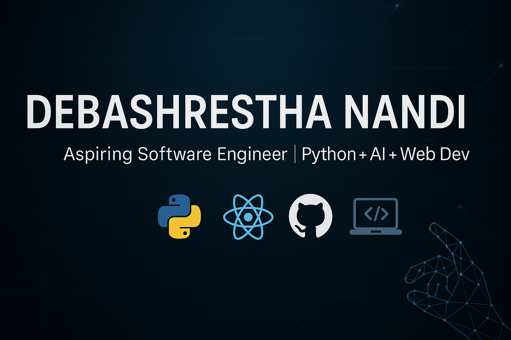

### 👋 Hi, I'm Debashrestha Nandi

🎓 Computer Science student at City College of New York (CCNY)  
💼 Data Engineering & Web Intern @ Thrift Label  
⚡ Passionate about building AI-powered tools, automation systems, and solving real-world problems through code  
🌱 Constantly learning, experimenting, and building — one line at a time  

---

###  Tech Stack

- **Languages**: Python, C++, HTML, CSS, JavaScript  
- **Frameworks**: Flask, React, Firebase  
- **Tools**: Git, GitHub, Selenium, Scrapy, Whisper AI, OpenCV, VS Code  
- **Other**: REST APIs, Web Scraping, Data Engineering, NLP, Gesture Recognition  

---

### 🔭 Current Projects

- 🖱️ [Touchless Drag-and-Drop Interface](https://github.com/undsiputed/Touchless-Drag-and-Drop-Interface): A hands-free interaction system using computer vision  
- 🎹 [Virtual Keyboard](https://github.com/undsiputed/Virtual-Keyboard): A gesture-controlled keyboard built with OpenCV  
- 🗺️ Route Optimizer: A map-based logistics tool that uses the Google Maps API to compute the fastest delivery path  
- 💼 Career Website: A personal portfolio + job board website to display achievements and projects using React & Vite  

---

### 🚀 Currently Learning

- Deploying full-stack applications with **CI/CD pipelines (GitHub Actions, Heroku, Vercel)**  
- Scaling AI tools with **cloud APIs and real-time data pipelines**  
- Building SaaS products using **automation-first design thinking**  
- Deep diving into **machine learning + data visualization** with real projects

---

### 📫 Let's Connect

📧 deb86011@gmail.com  
🌐 LinkedIn: [linkedin.com/in/debashrestha](https://linkedin.com/in/debashrestha)  
📍 Bronx, NY | Open to internships, hackathons & collaborations  

---

> “Code with purpose. Build with meaning.”

